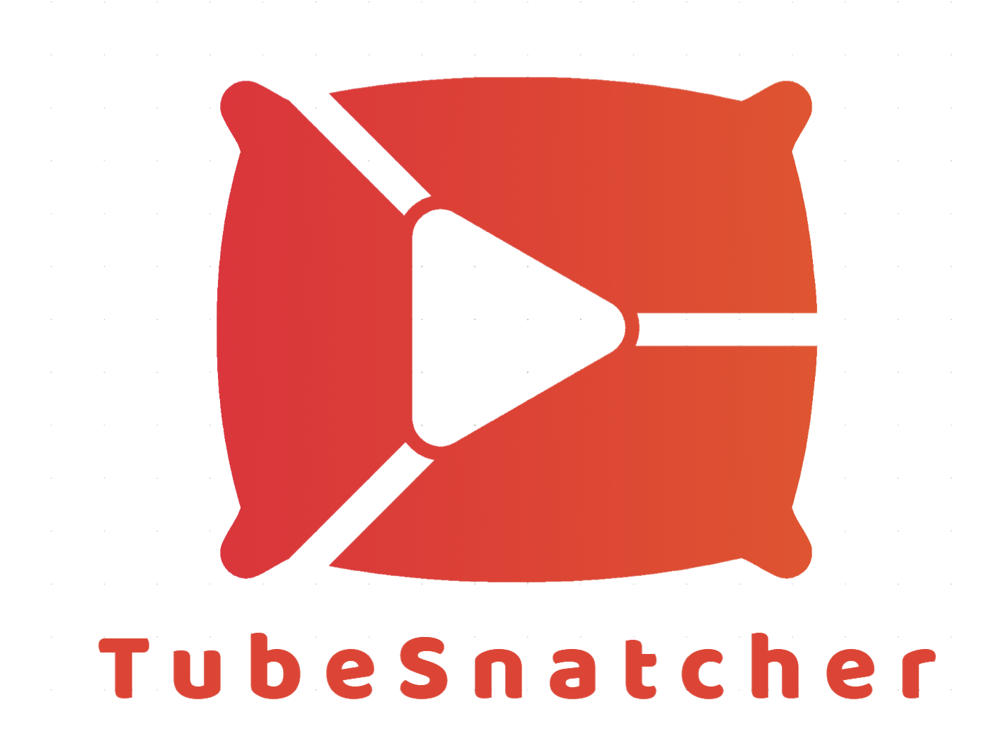

# TubeFetch


TubeFetch is a user-friendly Python application that allows you to search for YouTube videos, preview them, and download them in your preferred format and resolution. The application provides a graphical user interface (GUI) to make the process seamless and intuitive.

## Features

- **Search YouTube Videos**: Enter a search query to find YouTube videos.
- **More Results**: Load additional search results.
- **Preview**: Preview the selected video in a web browser.
- **Download Formats**: Choose between MP4 and MP3 formats.
- **Download Resolutions**: Select the resolution (highest, lowest, 1080p, 720p, 480p) for MP4 videos.
- **Choose Save Path**: Specify a directory to save downloaded files.
- **Progress Bar**: View the download progress with a progress bar.
- **Error Handling**: Comprehensive error handling to manage issues smoothly.

## Requirements

- Python 3.x
- `pytube`
- `google-api-python-client`
- `oauth2client`
- `tkinter`

## Installation

1. Clone the repository:
    ```sh
    git clone https://github.com/bsharabi/TubeFatch
    cd tubefetch
    ```

2. Install the required Python packages:
    ```sh
    pip install -r requirements.txt
    ```

3. Set up the YouTube Data API:
    - Go to the [Google Developers Console](https://console.developers.google.com/).
    - Create a new project and enable the YouTube Data API v3.
    - Generate an API key and replace `YOUR_YOUTUBE_API_KEY` in the script with your actual API key.

## Usage

1. Run the application:
    ```sh
    python tubefetch.py
    ```

2. Enter a search query in the search bar and click "Search".

3. Browse the results in the scrollable listbox. Click "More Results" to load more videos if available.

4. Select a video and click "Preview" to watch it in your web browser.

5. Choose the download format and resolution from the dropdown menus.

6. Click "Browse" to select the download directory, or leave it blank to use the default `./downloads` folder.

7. Click "Download" to start the download. The progress bar will display the download progress.

## License

This project is licensed under the MIT License.
